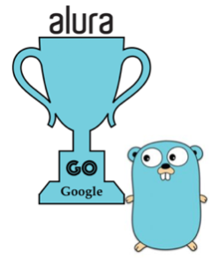
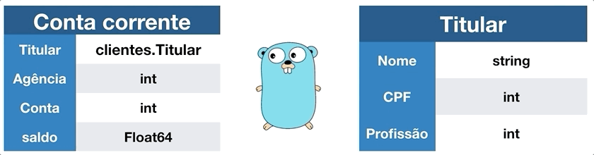
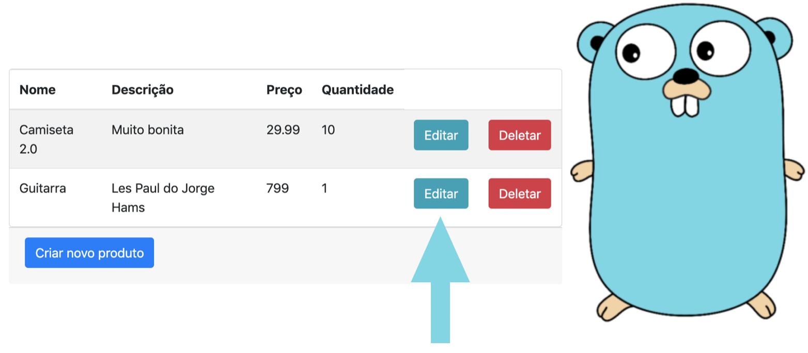

# GO lang

Documentação: https://go.dev/ref/spec . </br>
Go playground: https://go.dev/play/ .</br>
Para executar localmente utilizamos o comando `go run main.go` na pasta onde se encontra o arquivo `main.go`. Assim podemos acessar a aplicação no navegador: `http://localhost:8000/`.

Extensão recomendada para VS Code: https://marketplace.visualstudio.com/items?itemName=golang.go 



## Curso 1 - Go: Orientação a Objetos

- [GO lang](#go-lang)
  - [Curso 1 - Go: Orientação a Objetos](#curso-1---go-orientação-a-objetos)
    - [Variáveis](#variáveis)
      - [Declaração curta `:=`](#declaração-curta-)
      - [Ponteiro x Cópia](#ponteiro-x-cópia)
      - [Inicialização zero e nil](#inicialização-zero-e-nil)
    - [Type](#type)
      - [Mod](#mod)
      - [Visibilidade](#visibilidade)
    - [Struct](#struct)
      - [Formas de inicializar uma struct:](#formas-de-inicializar-uma-struct)
    - [Funções](#funções)
      - [Função anônima](#função-anônima)
      - [Função variádica (número variável de argumentos)](#função-variádica-número-variável-de-argumentos)
      - [Função como valor (funções de ordem superior)](#função-como-valor-funções-de-ordem-superior)
      - [Métodos](#métodos)
    - [Composição](#composição)
    - [Interface](#interface)
    - [Datas](#datas)
  - [Curso 2 - Go: Aplicação Web](#curso-2---go-aplicação-web)
    - [Conversão de tipos](#conversão-de-tipos)
  - [Curso 3 - Go: desenvolvendo uma API Rest](#curso-3---go-desenvolvendo-uma-api-rest)

O projeto deve estar localizado no go path: `/Users/<username>/go/src/`.

### Variáveis

#### Declaração curta `:=`
O `:=` é chamado de declaração curta (short variable declaration), e ele:
 - Declara uma nova variável
 - Atribui um valor a ela
 - Deduz automaticamente o tipo
Você não pode usar := fora de funções, como no escopo global.
O `=` indica apenas atribuição (variável já existe): `x = 20`

#### Ponteiro x Cópia
Utilizando o *, por exemplo `(p *Pessoa)` nos referimos a um ponteiro para a instância criada da estrutura Pessoa. Nesse caso, passamos para o método o valor encontrado neste ponteiro através do (p *Pessoa).
```go
func (p *Pessoa) ExibirNomeCompleto() string {
    nomeCompleto := p.nome + " " + p.sobrenome
    return nomeCompleto
}

func main() {
    p1 := Pessoa{"Guilherme", "Lima"}
    fmt.Println(p1.ExibirNomeCompleto()) // Recebemos o nome "Guilherme Lima" pois passamos o valor contino no ponteiro e a função é capaz de alterá-lo
}
```

A seguir passamos uma cópia do objketo Pessoa `(p Pessoa)`, assim a função não altera o valor do ponteiro pois trabalha com uma cópia do objeto, as alterações não serão refletidas na fonte.
```go

func (p Pessoa) ExibirNomeCompleto() string {
    p.sobrenome = "Silva"
    nomeCompleto := p.nome + " " + p.sobrenome
    return nomeCompleto
}

func main() {
    p1 := Pessoa{"Guilherme", "Lima"}

    fmt.Println(p1.ExibirNomeCompleto()) // Guilherme Silva
    fmt.Println(p1.nome, p1.sobrenome) // "Guilherme Lima, continua Lima pois a funcao não foi capaz de alterar o valor real do ponteiro
}
```

#### Inicialização zero e nil

Mesmo não provendo nenhum valor, o Go garante inicializar todas as variáveis, conforme a tabela abaixo:

| Zero initialization|  |
| ------------------ |:-----:|
| bool               | false |
| int                | 0     |
| float              | 0     |
| string             | ""    |
| struct             | {}    |

Ao atribuir o valor `nil` para uma variável devemos atrobuir um tipo para ela, caso contrário receberemos o erro `use of untyped nil`, que significa uso não tipado do nil. O compilador não sabe se esta variável é um inteiro, uma string, um array ou uma structure.

```go
func main() {
    var s *string = nil
    fmt.Println(s)
}
// Dessa maneira o programa compila e retorna <nil> como esperado.
```

Ao comparar variáveis não inicializadas de tipos diferentes recebemos erro.

```go
func main() {
    var f float64
    var i int 

    fmt.Println(f==i) // Error
}
```

Recebemos uma mensagem com um erro informando que os tipos são incompatíveis. Não podemos comparar o valor atribuído pela inicialização zero se temos tipos diferentes.

### Type

A palavra-chave type é usada para definir um novo tipo em Go. Ela serve como base para declarar:
 - Tipos personalizados (como NumeroDaConta int)
 - Structs
 - Interfaces
 - Aliases de tipos

```go
 type NumeroDaConta int
 var x NumeroDaConta = 12340 // NumeroDaConta é uma nova variável baseada no tipo int.
```

#### Mod
É necessário executar o comando `go mod init` na pasta onde está o arquivo `main.go`.
Ao fazer isso estamos inicializando um módulo Go na pasta onde está o arquivo main.go. Isso cria o arquivo go.mod, que declara a pasta do projeto como um módulo.

Essa ação é necessária para que a aplicação Go possa reconhecer os pacotes dentro desse módulo como pacotes válidos e importá-los com sucesso.

#### Visibilidade
Em Go, a visibilidade é determinada pela primeira letra do nome de um identificador. Se a primeira letra for maiúscula, o identificador é exportado, funciona como um "public" o que significa que ele pode ser acessado de outros pacotes. Se a primeira letra for minúscula, o identificador é não exportado, e só pode ser acessado dentro do mesmo pacote.

Por isso as propriedades da [ContaCorrente](curso-1-orientacao-objeto/contas/contaCorrente.go) estão em maiúsculo, para que possam ser acessadas em main.go.

### Struct
`struct` é uma estrutura de dados composta usada para agrupar diferentes campos sob um mesmo tipo. Sintaxe geral:
```go
type Pessoa struct {
    Nome  string
    Idade int
}
```

#### Formas de inicializar uma struct:

1. Literal Com nome dos campos: mais clara e recomendada, a ordem dos campos não importa
```go
    p := Pessoa{Nome: "João", Idade: 30}
```

2. Literal Sem nome dos campos: aordem dos camampos deve seguir a definição da struct
```go
    p := Pessoa{"João", 30}
```

3. Declaração e Atribuição Campo a Campo:
```go
    var p Pessoa
    p.Nome = "João"
    p.Idade = 30
```

4. Ponteiro para struct: útil quando você precisa modificar o valor ssm cópia, p é do tipo `*Pessoa`

Ponteiro para uma struct usando a função `new` e depois inicializa seus campos.
```go
    var pessoaAna *Pessoa
    pessoaAna = new(Pessoa)
    pessoaAna.Nome = "Ana"
    pessoaAna.Idade = 28
```

Alternativa mais compacta seria:
```go
    p := &Pessoa{Nome: "Ana", Idade: 30}
```

### Funções

Uma [declaração de função](https://go.dev/ref/spec#Function_declarations) utiliza a palavra "func", vincula um [identificador](https://go.dev/ref/spec#Identifiers) (o nome da função) parâmetros de tipo, assinatura, e o corpo da função.

```go
    func soma(a int, b int) int {
    return a + b
}
// "func" → palavra-chave obrigatória
// soma → nome da função
// Assinatura → (a int, b int) int
// CorpoDaFunção → { return a + b }
```

A função pode declarar parâmetors de resultado (retorno), nesse caso a fn deve terminar em uma [instrução de terminação](https://go.dev/ref/spec#Terminating_statements).
```go 
func dobrar(x int) int {
    return x * 2
}
```

Uma função pode ter múltiplos retornos.
Em Go, é muito comum que funções retornem dois valores: o resultado da operação e um erro (error). Esse padrão permite que o código seja seguro e explicite possíveis falhas sem usar exceções
```go
import (
    "fmt"
    "os"
)

func lerArquivo(nome string) (string, error) {
    dados, err := os.ReadFile(nome)
    if err != nil {
        return "", err
    }
    return string(dados), nil
}
func main() {
    conteudo, err := lerArquivo("exemplo.txt")
    if err != nil {
        fmt.Println("Erro ao ler o arquivo:", err)
        return
    }
    fmt.Println("Conteúdo do arquivo:")
    fmt.Println(conteudo)
}

```

Uma função pode ter um, muitos ou nenhum parâmetro:

<details>
<summary>Exemplos de funções passando número variável de parâmetros</summary>

```go
    func SemParametro() string {
        return "Exemplo de função sem parâmetro!"
    }

    func UmParametro(texto string) string {
        return texto
    }

    func DoisParametros(texto string, numero int) (string, int) {
        return texto, numero
    }

    func main() {
        fmt.Println(SemParametro())
        fmt.Println(UmParametro("Exemplo de função com um parâmetro"))
        fmt.Println(DoisParametros("Passando dois parâmetros: essa string e o número", 10))
    }
```
</details>

#### Função anônima
Útil para funções inline ou passar como argumento.
```go
soma := func(a, b int) int {
    return a + b
}
fmt.Println(soma(2, 3))
```

#### Função variádica (número variável de argumentos)
Uma variadic function tem um tipo prefixado com `...`e pode ser invocada com zero ou mais argumentos para esse parâmetro.
```go
func Somando(numeros ...int) int {
    total := 0
    for _, numero := range numeros {
        total += numero
    }
    return total
}

func main() {
    fmt.Println(Somando(1))
    fmt.Println(Somando(1,1))
    fmt.Println(Somando(1,1,1))
    fmt.Println(Somando(1,1,2,4))
}
```

#### Função como valor (funções de ordem superior)
Recebe outra função como parâmetro:
```go
func aplicar(f func(int) int, valor int) int {
    return f(valor)
}

func dobrar(x int) int {
    return x * 2
}

resultado := aplicar(dobrar, 5) // resultado = 10
```

#### Métodos
Um método é uma função especial que tem um receptor (receiver), e esse receptor é o que o vincula a um tipo definido (geralmente uma struct).

 - Receiver
O receptor é o tipo ao qual o método está vinculado.
Funciona como o `this` em outras linguagens (embora em Go ele seja explícito).
Pode ser:
 - por valor → `func (p Pessoa)`, cópia da struct, mudanças não afetam o original
 - por ponteiro → `func (p *Pessoa)`, permite modificar os campos da struct diretamente, ou seja, mudanças afetam o objeto original

```go
type Pessoa struct {
    Nome string
    Idade int
}

// Método com receptor por valor
func (p Pessoa) Saudacao() string {
    return "Olá, meu nome é " + p.Nome
}
```

### Composição



Composição no Go é usado no lugar de herança, já que Go não tem herança clássica como em linguagens orientadas a objetos tradicionais.

Em Go, composição significa que um tipo pode incluir outros tipos dentro dele — e com isso herdar seu comportamento (métodos e campos) por delegação.
```go
type Animal struct{}

func (a Animal) Respirar() {
    fmt.Println("Respirando...")
}

type Cachorro struct {
    Animal // composição
    Nome string
}
// Uso
func main() {
    c := Cachorro{Nome: "Bolt"}
    c.Respirar() // método herdado via composição
}
```

### Interface

Uma interface em Go define um conjunto de métodos que um tipo precisa implementar, sem definir como eles são implementados.

Go não usa `implements` como em Java. A implementação é implícita — se o tipo tem os métodos exigidos, ele já implementa a interface.

```go
type Conta interface {
	Sacar(valor float64) string
}
func PagarBoleto(conta Conta, valorDoBoleto float64) {
	conta.Sacar(valorDoBoleto)
}

type ContaCorrente struct {}
// ContaCorrente implementa a interface Conta, pois tem um método com a mesma identificação e mesma assinatura (Sacar)
func (c *ContaCorrente) Sacar(valorDoSaque float64) string {
	...
}

func main() {
    c := ContaCorrente{}
    PagarBoleto(c) 
}
```

### Datas
Para a formatação de datas com Golang [artigo](https://www.alura.com.br/artigos/golang-trabalhando-com-datas) é utilizada uma data de exemplo fixa que serve como modelo e segue uma tabela de valores.

<details>
<summary>Tabela de valores de referência de data e hora</summary>

| O que queremos editar             | Código |
|----------------------------------|--------|
| dia (com zero)                   | 02     |
| dia (sem o zero)                 | 2      |
| dia da semana (inteiro)          | Monday |
| dia da semana abreviado          | Mon    |
| mês com número (com zero)        | 01     |
| mês com número (sem zero)        | 1      |
| mês (nome inteiro)               | January|
| mês (nome abreviado)             | Jan    |
| ano (inteiro)                    | 2006   |
| ano (abreviado)                  | 06     |
| hora (com zero)                  | 03     |
| hora (sem zero)                  | 3      |
| hora (formato 24 horas)          | 15     |
| minutos (com zero)               | 04     |
| minutos (sem zero)               | 4      |
| segundos (com zero)              | 05     |
| segundos (sem zero)              | 5      |
</details>

```go
package main
import (
    "fmt"
    "time"
)
func main() {
    data := time.Now()
    fmt.Println(data.Format(("02/Jan/2006 15:04:05 ")))
}
```

Exemplos:

```go
2006-01-02
20060102
January 02, 2006
02 January 2006
02-Jan-2006
02/01/2006
02/01/06
010206
Jan-02-06
Jan-02-2006
06
Mon
Monday
Jan-06
02-01-2006
2006-01-02
02/01/2006 15:04
02/01/2006 03:04 PM
Mon, 02 Jan 2006
```

## Curso 2 - Go: Aplicação Web

Para criar o servidor e conseguir exibir uma página html, no arquivo `main.go` foram utilizadas as funções HandleFunc e ListenAndServe do pacote `net/http`.
No arquivo `index.html` foi definido entre 2 chaves {{ }} a referência passada na função `ExecuteTemplate` ([main.go](curso-2-aplicacao-web/main.go)).

Criamos um banco de dados Postgresql local e com o PgAdmin criamos as tabelas.

<details>
<summary>SQL de criacao da tabela produtos e inserção de dados</summary>

```sql
create table produtos (	
	id serial primary key,
	nome varchar,
	descricao varchar,
	preco decimal,
	quantidade integer
)
insert into produtos (nome, descricao, preco, quantidade) values
('Camiseta', 'Preta', 19, 10),
('Fone de ouvido', 'Bluetooth', 99, 5);
```
</details>

Para conectar com o banco de dados acessamos o site `https://godoc.org/`, pesquisamos "postgres" e encontramos a biblioteca de integração com postgres `pq` (https://pkg.go.dev/github.com/lib/pq). Instalamos seguindo os comandos da documantação e adicionamos os dados da conexão em [main.go](curso-2-aplicacao-web/main.go):

```shell
go mod init
go mod tidy
go get github.com/lib/pq
```

No template foi utilizado o formulário  `<form method="POST" action="insert-produto-db">` onde a action está definida numa rota no arquivo [routes](curso-2-aplicacao-web/routes/routes.go): `http.HandleFunc("/insert-produto-db", controllers.InsertDb)`. 

O controller captura os valores com `request.FormValue()` e executa a função [models/produtos/CriarProdutoDb()](curso-2-aplicacao-web/models/produtos.go) na classe model. A classe `model` é que utiliza da linguagem SQL e manipula dados no banco.

É possível adicionar código javascript passando parâmetros e utilizando funções Go. Exemplo no arquivo [curso-2-aplicacao-web/templates/index.html](/curso-2-aplicacao-web/templates/index.html):
`<button onClick="onDelete('{{.Id}}')" class="btn btn-danger btn-sm">Deletar</button>`.

<details>
<summary>Exemplo de função para deletar produto do banco de dados</summary>

```go
func DeletarProdutoDb(id string) {
	db := db.ConectaComBancoDeDados()
	deletaProdutoInstrucao, err := db.Prepare("DELETE FROM produtos WHERE id=$1")
	if err != nil {
		panic(err.Error())
	}
	deletaProdutoInstrucao.Exec(id)
	db.Close()
}
```
</details>



### Conversão de tipos
De string para int usamos o pacote `strconv`

```go
    salario := "1000"
	salarioInt, err := strconv.Atoi(salario)
	if err != nil {
		fmt.Println(err)
	}
    salarioString := strconv.Itoa(salarioInt)
	fmt.Println(salarioString)
```

## Curso 3 - Go: desenvolvendo uma API Rest

Até então criamos os nossos projetos no diretório na go path(`/Users/<username>/go/src/`). Iremos criar o nosso projeto em qualquer pasta do computador. No terminal da pasta do projeto executamos `go mod init <description>`. Geralmente coloca-se o link do git-hub do repositório do projeto, por exemplo:

> go mod init github.com/kamilaserpa/go-study
> go mod tidy

Iremos utilizar um ORM (Object-Relational Mapping) é uma técnica de programação que permite que você interaja com um banco de dados usando a linguagem de programação que você está utilizando (no nosso caso, Go) de uma forma mais intuitiva, como se estivesse trabalhando diretamente com objetos.
Por exemplo, ao escrever `produto := orm.Find(Produto, 1)` o ORM se encarrega de gerar a consulta SQL correspondente (`SELECT * FROM produtos WHERE id = 1`).

Utilizamos a descrição `json:"<nome-para-serializacao>"` para descrever como o atributo será serializado para o formato json:
```go
    type Personalidade struct {
        ID        int    `json:"id"`
        Nome      string `json:"nome"`
        Historia  string `json:"historia"`
    }
```

